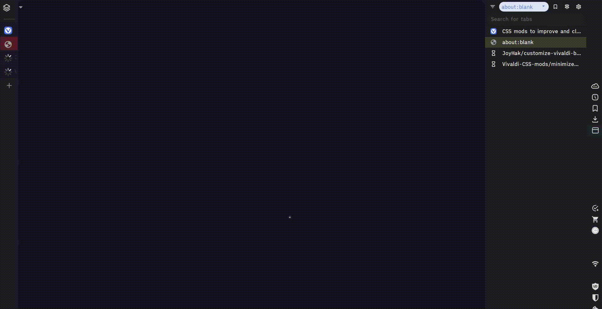

This is a collection of my and other authors' useful CSS mods to improve and clean up the interface of Vivaldi browser. 

## Quick Start

## Files Index

1. [**hide_UI**](https://forum.vivaldi.net/topic/104178/css-mods-to-improve-and-clean-ui?_=1781450284238): 

   auto-hide address bar (mainbar) and move the page loading progress bar beyond mainbar. 

2. [**clear_UI**](https://forum.vivaldi.net/topic/104178/css-mods-to-improve-and-clean-ui?_=1781450284238): 

   сlear the interface of unnecessary stuff.

3. **svg_extensions_icons**: 

   monochrome svg icons for extensions. Resets when the contents of the toolbar are changed.
   > If you want powerful icons customization: https://github.com/JoyHak/customize-vivaldi-buttons

5. [hide_tabs](https://forum.vivaldi.net/topic/46458/automate-floating-vertical-tabbar-for-mouse-keyboard/148?_=1735482155591) by supra107, R0STEFAN: 

   auto-hide the tab bar and display on mouseover.

6. [minimize_tabs](https://forum.vivaldi.net/topic/82900/vertical-tabs-collapsed-expand-on-hover/132?_=1735482155600) by nirin, masashinogawa, nafumofu:

   minimizes the tab bar into rows.

7. [expand_bookmarks](https://forum.vivaldi.net/topic/96123/expand-folders-with-a-single-click-css-only?_=1735482587809) by nafumofu:

   expands and collapses folders in a list, such as bookmarks, with a single click

Don't forget to visit the other repositories as well:
1. https://github.com/quartz1216/vivaldi-gutter
2. https://github.com/luetage/vivaldi_modding
3. https://github.com/shaneburns/vivaldi-mods
