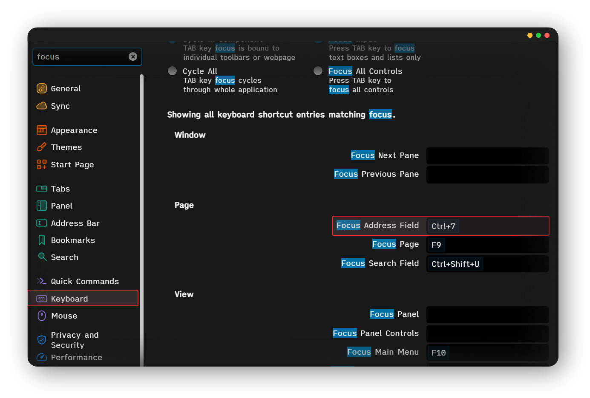

This is a collection of my and other authors' useful CSS mods to improve and clean up the interface of Vivaldi browser. 

## Quick Start

To change Vivaldi UI via `css` modifications you need to [enable CSS flag](https://forum.vivaldi.net/topic/10549/modding-vivaldi):
1. Open <a href="chrome://flags/#vivaldi-css-mods">chrome://flags/#vivaldi-css-mods</a>.
2. Check `Allow CSS modifications`.

3. Open `Appearance` section in Settings.
4. Under "Custom UI Modifications" choose the folder you want to use.
5. [Download mods](https://github.com/JoyHak/Vivaldi-CSS-mods/archive/refs/heads/main.zip) and place `.css` files inside this folder. 

Two main mods ([clear](clear_UI.css) and [hide](hide_UI.css) UI) can change some colors to `#191919` and main font to [iMWritingQuat](https://github.com/ryanoasis/nerd-fonts/tree/master/patched-fonts/iA-Writer/Quattro). If you want UI consistency, you can download [this font](https://github.com/ryanoasis/nerd-fonts/tree/master/patched-fonts/iA-Writer/Quattro) and [Breeze Dark theme](https://github.com/JoyHak/Vivaldi-CSS-mods/blob/main/breeze-dark.zip).

Then you can import Breeze dark on `Themes` tab. Downloaded font can be applied on `Webpages` tab.

## Files Index

1. [**hide_UI**](https://forum.vivaldi.net/topic/104178/css-mods-to-improve-and-clean-ui?_=1781450284238): 

   Make horizontal tabs more compact; auto-hide address bar. To show it, move your mouse at the Vivaldi window top or assign shortcut to `Focus Address Field` action.
   

   Each tab becomes smaller, therefore it can display longer text.
   
   

3. [**clear_UI**](https://forum.vivaldi.net/topic/104178/css-mods-to-improve-and-clean-ui?_=1781450284238): 

    Applies [iMWritingQuat font](https://github.com/ryanoasis/nerd-fonts/tree/master/patched-fonts/iA-Writer/Quattro) to UI elements.
   

Removes some UI elements

   - scrollbar (enable  turn on vivaldi://flags/#overlay-scrollbars)
   - expand, minimize, close window buttons (top right corner)
   - Vivaldi logo (top left corner)
   - Vivaldi settings window title
   - tabs in "toggle UI" mode (`Settings > Keyboard > View > Toggle UI`)
   - some distracting borders and shadows
   
   

   

Changes background color to dark gray

   Applies 191919 (hex) or 25, 25, 25 (rgb) dark gray color to:
   - some borders to hide them
   - popup elements
   - main window
   - settings
   - address bar and url field
   
   

   

5. **svg_extensions_icons**: 

   monochrome svg icons for extensions. Resets when the contents of the toolbar are changed.
   > If you want powerful icons customization: https://github.com/JoyHak/customize-vivaldi-buttons

6. [hide_tabs](https://forum.vivaldi.net/topic/46458/automate-floating-vertical-tabbar-for-mouse-keyboard/148?_=1735482155591) by supra107, R0STEFAN: 

   auto-hide the tab bar and display on mouseover.

7. [minimize_tabs](https://forum.vivaldi.net/topic/82900/vertical-tabs-collapsed-expand-on-hover/132?_=1735482155600) by nirin, masashinogawa, nafumofu:

   minimizes the tab bar into rows.

8. [expand_bookmarks](https://forum.vivaldi.net/topic/96123/expand-folders-with-a-single-click-css-only?_=1735482587809) by nafumofu:

   expands and collapses folders in a list, such as bookmarks, with a single click

Don't forget to visit the other repositories as well:
1. https://github.com/quartz1216/vivaldi-gutter
2. https://github.com/luetage/vivaldi_modding
3. https://github.com/shaneburns/vivaldi-mods
